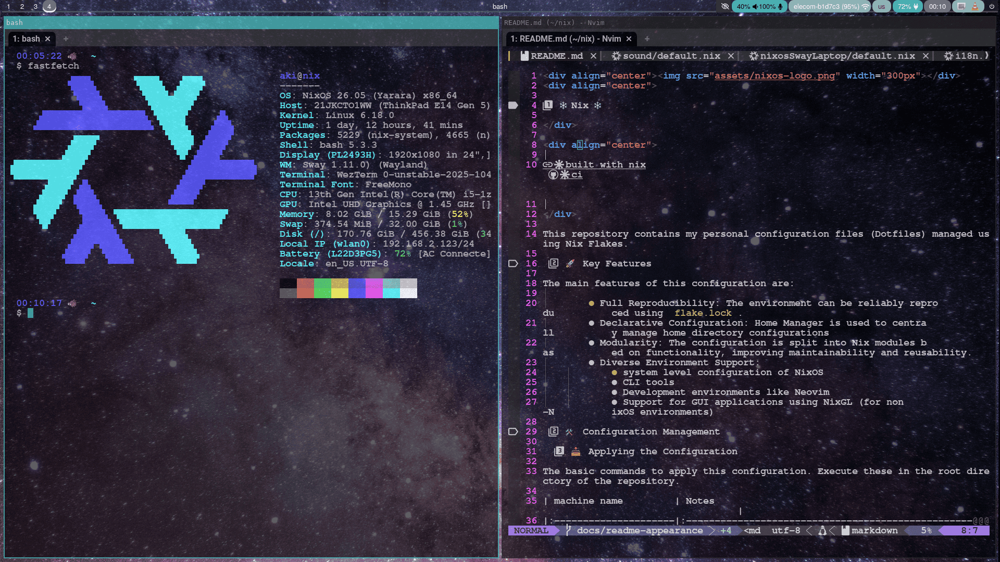

<div align="center"></div>
<div align="center">

# ❄️Nix ❄️ 

</div>

<div align="center">

[](https://builtwithnix.org) [](https://github.com/aki-ph-chem/nix/actions/workflows/updates.yaml)

</div>

This repository contains my personal configuration files (Dotfiles) managed using **Nix** Flakes.

## 🚀 Key Features

The main features of this configuration are:

  - **Full Reproducibility**: The environment can be **reliably reproduced** using `flake.lock`.
  - **Declarative Configuration**: **Home Manager** is used to centrally manage **home directory** configurations   
  - **Modularity**: The configuration is split into **Nix modules** based on functionality, improving maintainability and reusability.
  - **Diverse Environment Support**:
      - system level configuration of NixOS
      - Hardware configuration
      - **CLI** tools
      - Development environments like **Neovim**
      - Support for **GUI applications** using **NixGL** (for non-NixOS environments)

## 🛠️ Configuration Management

### 📥 Applying the Configuration

The basic commands to apply this configuration. Execute these in the root directory of the repository.

| machine name         | Notes                                                                                  |
|:---------------------|:---------------------------------------------------------------------------------------|
| **archXfce**         | Applies CLI tools and general settings.                                                |
| **archSway**         | Applies **Sway** related packages and gui app packages (sets an environment variable). |
| **nixosSwayDesktop** | config for NixOS + Sway                                                                |
| **nixosSwayLaptop**  | config for NixOS + Sway (LUKS encryption + secure boot)                                |

- for Arch Linux + sway

```bash
home-manager switch --flake .#archSway --impure
```

- for Arch Linux + Xfce 

```bash
home-manager switch --flake .#archXfce --impure
```

- for NixOS + sway

```bash
sudo nixos-rebuild switch --flake .#nixosSwayDesktop --impure
```

```bash
sudo nixos-rebuild switch --flake .#nixosSwayLaptop --impure
```

### 🔄 Updating Packages

Update the inputs (e.g., **Nixpkgs** and other Flakes) and reapply the configuration.

```bash
nix flake update            # Updates Flake dependencies (all inputs) (e.g., nixpkgs, home-manager) and rewrites flake.lock
nix flake update <input a> <input b> ... # Updates specific inputs
home-manager switch --flake .#<machine name> --impure # Applies the updated configuration (Standard)
sudo nixos-rebuild switch --flake .#<machine name> --impure # Applies the updated configuration (for NixOS)
```

### 🌳 Directory Structure 🌳

The configuration files are organized as follows(Folded):

<details>
<summary>here</summary>

| File/path                                                  | Description                                                                                                      |
|------------------------------------------------------------|------------------------------------------------------------------------------------------------------------------|
| [`flake.nix`](./flake.nix)                                 | The Entry point and declaration of my configuration. The Home Manager instance is also declared here.            |
| [`flake.lock`](./flake.lock)                               | The lock file that  guarantees the **reproducibility** of the Flake.                                             |
| [`hosts/archSway/`](./hosts/archSway)                      | configs for Arch Linux + Sway                                                                                    |
| [`hosts/archXfce/`](./hosts/archXfce)                      | configs for Arch Linux + Xfce                                                                                    |
| [`hosts/nixosSwayDesktop/`](./hosts/nixosSwayDesktop)      | configs for NixOS + Sway for Desktop machine                                                                     |
| [`hosts/nixosSwayLapktop/`](./hosts/nixosSwayLaptop)       | configs for NixOS + Sway for Laptop machine                                                                      |
| [`modules/`](./modules)                                    | Directory for **Nix modules** split by functionality.                                                            |
| [`modules/cli-tools.nix`](./modules/cli-tools.nix)         | Configuration and installation for **CLI applications**                                                          |
| [`modules/git.nix`](./modules/git.nix)                     | **Git** configuration.                                                                                           |
| [`modules/gui-app-nixgl.nix`](./modules/gui-app-nixgl.nix) | Installation of **GUI applications**. Includes settings for using **NixGL** in non-NixOS environments.           |
| [`modules/i18n.nix`](./modules/i18n.nix)                   | Configuration related to **Internationalization** (I18n) and **IME** (e.g., `fcitx5`).                           |
| [`modules/neovim.nix`](./modules/neovim.nix)               | **Neovim** configuration, including LSP,formatter, ..etc (**NOT** include plugins).                              |
| [`modules/neovide-nixgl.nix`](./modules/neovide-nixgl.nix) | **Neovide**(extra GUI for neovim) configuration Includes settings for using **NixGL** in non-NixOS environments. |
| [`modules/sway-related.nix`](./modules/sway-related.nix)   | Configuration for the **Sway** window manager related packages (e.g., `waybar`, `rofi`).                         |
| [`nixos/`](./nixos)                                        | Configurations for the **NixOS**                                                                                 |
| [`nixos/fonts/`](./nixos/fonts)                            | Configurations for the fonts                                                                                     |
| [`nixos/gpg/`](./nixos/gpg)                                | Configurations for the gpg-agent                                                                                 |
| [`nixos/gui-app/`](./nixos/gui-app)                        | Configurations for the gui apps                                                                                  |
| [`nixos/locale/`](./nixos/locale)                          | Configurations for locale                                                                                        |
| [`nixos/nix-ld/`](./nixos/nix-ld)                          | Configurations for `nix-ld`                                                                                      |
| [`nixos/polkit/`](./nixos/polkit)                          | Configurations for `pokit`                                                                                       |
| [`nixos/sound/`](./nixos/sound/)                           | Configurations for sound                                                                                         |
| [`nixos/sway/`](./nixos/sway)                              | Configurations for sway & sway related packages                                                                  |
| [`nixos/virtualisation/`](./nixos/virtualisation)          | Configurations for Docker & libvirt (QEMU/KVM)                                                                   |

</details>

### 🖼️ Desktop preview

####  Sway

<div align="center"></div>

## 🧹 Maintenance Commands

### 🗑️ Cleaning Up Old Generations

Removes files from `/nix/store` that are no longer referenced by **old generations** (previous states of the system or home environment), freeing up disk space.

```bash
nix-collect-garbage --delete-old # delete all old generations
nix-collect-garbage --delete-older-than 7d # delete  older than 7days ago 
nix-collect-garbage --delete-older-than 30d # delete  older than 30days ago 
```

### 🔍 Package Search

Search for available packages within the Nixpkgs repository.

```bash
nix search nixpkgs <package name>
```

or search package name in https://search.nixos.org/packages.
